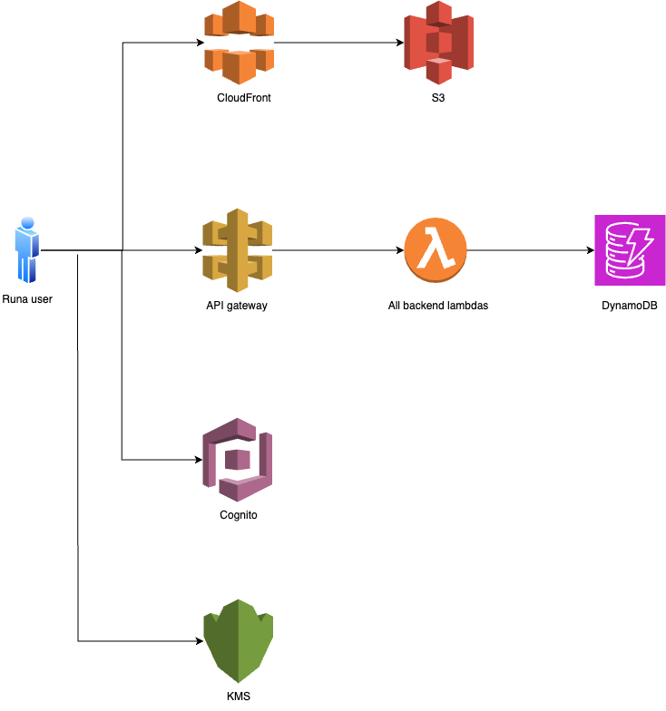

# RunaVault

RunaVault is a secure, serverless password management application built using AWS free-tier services and a React frontend. It enables users to create, manage, and share encrypted secrets (e.g., passwords) with individuals or groups, leveraging AWS Cognito for authentication, DynamoDB for storage, and KMS for encryption.

## Screenshots
<details>
<summary>Click to view screenshots</summary>


</details>

## Architecture



## Lambda functions are being used for:
- CRUD operations on Dynamodb table
- CRUD operations on Cognito user pool

## Features

- **User Management**: Create and manage users and groups via an admin panel. Note: The user must be added to Admin group to have access to Admin panel.
- **Multi-Factor Authentication**: All users are required to enable MFA by default for enhanced account security.
- **Secret Management**: Store, edit, and delete encrypted secrets with optional tags and subdirectories.
- **Sharing**: Share secrets with individual users or groups with role-based permissions (Viewer/Editor).
- **Encryption**: Passwords are encrypted client-side using AWS KMS keys.
- **Favorites**: Mark secrets as favorites for quick access.
- **Search & Filter**: Search secrets by site, username, notes, or tags; filter by favorites.
- **Responsive UI**: Built with React, FontAwesome icons, and react-select for a modern, user-friendly interface.
- **Dark and Light themes**: You can switch between dark and light themes. 

### Detailed Architecture

### Frontend
- **Framework**: React with hooks (`useState`, `useEffect`, `useCallback`) for state management.
- **Components**:
  - `AdminPanel`: Manage users and groups within RunaVault.
  - `CreateSecretForm`: Form to create new secrets with sharing options.
  - `SecretsTab`: Display and manage secrets with a directory structure.
  - `UserInfoTab`: Display user details and group memberships.
- **Styling**: Custom CSS (`App.css`) with Bootstrap-inspired classes.
- **Dependencies**: `react-select`, `react-oidc-context`, `@fortawesome/react-fontawesome`.

### Backend
- **Serverless**: Built using AWS Lambda Graviton2 for compute.
- **Authentication**: AWS Cognito for user authentication and group management.
- **API**: AWS API Gateway for RESTful endpoints, secured with Cognito JWT tokens.
- **Storage**: AWS DynamoDB for storing encrypted secrets and metadata. With enabled [Point-in-time-recovery](https://aws.amazon.com/dynamodb/pitr/)
- **Encryption**: AWS KMS key for encrypting/decrypting passwords client-side.
- **CDN**: AWS CloudFront for serving the RunaVault frontend with low latency.

RunaVault's backend is designed to operate within AWS's free tier, making it cost-effective for small-scale deployments.

## Prerequisites

- **Python 3.12+**: For backend development.
- **AWS Account**: Access to free-tier services (Lambda, Cognito, API Gateway, CloudFront, DynamoDB, KMS, S3, ACM, Route 53).
- **AWS CDK**: For infrastructure deployment (or OpenTofu as an alternative).
- **AWS CLI**: Configured with credentials for deployment.
- **Docker**: To build lambda layers locally

## Setup and Deployment

### Frontend and Backend
1. Clone the repository:
   ```bash
   $ git clone https://github.com/tokarev-artem/Runavault-python.git
   $ cd RunaVault-python
   ```

2. Navigate to the cdk directory:
   ```bash
   $ cd cdk
   ```

3. Run to bootstrap cdk in account
   ```bash
   $ cdk bootstrap
   ```

4. Validate templates:
   ```bash
   $ cdk synth
   ```

5. Deploy the stack
   ```bash
   $ cdk deploy
   ```

6. Create .env file to deploy frontend
      ```bash
   $ cp ../frontend/.env.example ../frontend/.env
   ```
7. Update .env file with values from cdk output
   ```bash
   REACT_APP_API_GATEWAY_ENDPOINT=<APIGATEWAYENDPOINT>
   REACT_APP_KMS_KEY_ID=<KMSKEYID>
   REACT_APP_AWS_REGION=us-east-1
   REACT_APP_COGNITO_CLIENT_ID=<COGNITOCLIENTID>
   REACT_APP_IDENTITY_POOL_ID=<IDENTITYPOOLID>
   REACT_APP_COGNITO_DOMAIN=COGNITODOMAIN
   REACT_APP_COGNITO_ID=<COGNITOID>
   ```

7. Deploy frontend
   ```bash
   $ cd ../frontend
   $ npm install
   $ npm run build
   ```

8. Deploy cdk one more time to update S3 bucket
   ```bash
   $ cd ../cdk
   $ cdk synth
   $ cdk deploy
   ```
9. Create initial cognito user, the rest of the users - will be added from admin panel. Where COGNITOID is from cdk output
   
   > **_NOTE:_**  The username must be a valid email address.

   > **_NOTE:_**  The generated password will be emailed, copy it without the trailing dot.

   ```bash
   $ aws cognito-idp admin-create-user --user-pool-id <COGNITOID> --username user@example.com --user-attributes Name=given_name,Value=John Name=family_name,Value=Smith Name=email,Value=user@example.com
   ```

   And add the user to Admin group to have access to Admin panel
   ```bash
   $ aws cognito-idp admin-add-user-to-group --user-pool-id <COGNITOID> --username user@example.com --group-name Admin
   ```
10. Change password and enable MFA

<details>
<summary>Click to view screenshots</summary>


</details>

## Usage

1. **Sign In**: Authenticate via Cognito using the RunaVault frontend.
2. **Admin Panel**: Accessible to admin users to manage users and groups.
3. **Create Secrets**: Use the "Create New Secret" form to add credentials.
4. **Manage Secrets**: View, edit, or delete secrets in the "Secrets" tab; share with users or groups.
5. **Directory Sharing**: Share entire subdirectories with specific permissions.

## Security Considerations

- Passwords are encrypted client-side using AWS KMS before being sent to the backend.
- Sharing uses role-based access control (Viewer/Editor) enforced by Cognito groups.
- Tokens (ID, Access, Refresh) are handled securely via `react-oidc-context` and validated at API Gateway and Lambda levels.
- Avoid sharing "Danger Area" information (e.g., tokens) displayed in the User Info tab.
- All users must enable Multi-Factor Authentication (MFA) as part of the Cognito signup flow, adding an extra layer of protection beyond username and password.


## Approximate Costs

RunaVault leverages AWS free-tier services where possible. Below are approximate costs based on minimal usage, assuming you stay within the free tier initially and scale slightly beyond it. Costs are in USD and based on the US East (N. Virginia) region as of April 2025; check [AWS Pricing](https://aws.amazon.com/pricing/) for current rates.

| **Service**       | **Free Tier**                          | **Beyond Free Tier (Example Usage)**             | **Approx. Monthly Cost** |
|--------------------|----------------------------------------|--------------------------------------------------|--------------------------|
| **Lambda**        | 1M requests, 3.2M seconds (128 MB)    | 1.5M requests, 4M seconds: $0.30 + $0.80         | $1.10                   |
| **DynamoDB**      | 25 GB storage, 25 WCUs/RCUs           | 30 GB, 30 WCUs/RCUs: $1.25 + $0.14              | $1.39                   |
| **Cognito**       | 50,000 MAUs (first 12 months)          | 100 MAUs: Free (within free tier)               | $0.00                   |
| **CloudFront**    | 1 TB data transfer, 10M requests       | 1.2 TB, 12M requests: $0.02 + $0.01             | $0.03                   |
| **S3**            | 5 GB storage, 20,000 GET, 2,000 PUT    | 10 GB, 25k GET, 3k PUT: $0.23 + $0.02 + $0.01   | $0.26                   |
| **ACM**           | Free for public certificates           | No additional cost                              | $0.00                   |
| **Route 53**      | $0.50 per hosted zone/month (first not free) | 1 hosted zone, 1M queries: $0.50 + $0.40    | $0.90                   |
| **API Gateway**   | 1M REST API calls (first 12 months)    | 1.5M calls: $1.75                               | $1.75                   |
| **KMS (Key Storage)** | 1 customer-managed key: $1.00         | 1 customer-managed key: $1.00                   | $1.00                   |
| **KMS (API Requests)** | 20,000 requests/month              | 25,000 requests: $0.15                          | $0.15  

- **Total Free Tier Cost**: $0.00/month (first 12 months, within limits).
- **Total Beyond Free Tier**: ~$5.43/month (example usage above).
- **Notes**:
  - Costs scale with usage (e.g., more users, requests, or storage).
  - KMS costs are minimal (~$0.03 per 10,000 requests) and often negligible for small-scale use.
  - Route 53 assumes a custom domain; skip this cost if using default AWS domains.

## Contributing

1. Fork the repository.
2. Create a feature branch (`git checkout -b feature/your-feature`).
3. Commit changes (`git commit -m "Add your feature to RunaVault"`).
4. Push to the branch (`git push origin feature/your-feature`).
5. Open a Pull Request.

## License

RunaVault is licensed under the GNU GPL License - see the [LICENSE](LICENSE) file for details.

## Acknowledgments

- Thanks to AWS for providing free-tier services to enable RunaVault's serverless architecture.

## Support This Project

This project is open-source and maintained in my free time. If you find it useful, consider supporting its development:

- [Donate via GitHub Sponsors](https://github.com/sponsors/tokarev-artem)
- [Buy Me a Coffee](https://buymeacoffee.com/tokarevartem)
- [Paypal](https://www.paypal.me/ArtemiyTokarev)

Your support helps keep the project active and maintained. Thank you!
